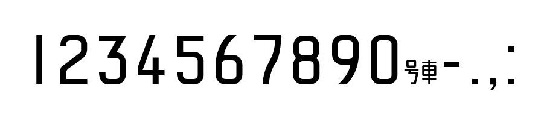

# TRTA Numbers



TRTA Numbers（ティーアルティーエイ・ナンバーズ）は帝都高速度交通営団（現：東京メトロ）の車両番号などに使用されている書体にインスパイアされた数字専用フォントです。

車両での表記に使われている文字に加え、約物などを追加しています。
以下の文字が利用できます。

```
0 1 2 3 4 5 6 7 8 9 , . : - 号車
```
「号車」は c (アルファベット小文字C)に割り当てられています。「号」「車」と1文字ずつ利用することはできません。

## バリエーション

### TRTA Numbers Sharp

鋭い角を持つ、通常のスタイルです。

[TTFファイルはこちら](./ttf/trta_numbers_sharp.ttf)

### TRTA Numbers Rounded

一部の字形の角が丸められたスタイルです（近日リリース予定）。

## 製作の動機

営団の車番を再現したフォントが過去に配布されていたそうですが、現在はサイトが消滅しているようで、残念ながら入手できませんでした（2022年12月現在）。個人的にこのユニークかつ美しいタイプフェイスを利用したかったこともあり、以下の目標を掲げて作成・配布を行うことにしました。

- （車輪の再発明にはなるが）自力でフォントデータ再度作り、公開すること
- 安心して利用できるオープンなライセンスを付与すること

作者が銀座線1000系などの車番を撮影し、それをベースにベクタデータを起こしています（既存のフォントデータなどは使用していません）。

## 利用上の注意点

### 技術的・仕様的な情報

- 字間は原則として側面の車番を表記することに最適化しており、号車表記などでは調節の必要があります。Illustratorなど文字単位で字間が調節できるアプリケーションの使用をおすすめします。
- 便宜上、**c**（小文字のC）を「号車」に割り当てています。システムフォントやWebページ全体のフォントとして指定した場合、表示に不具合が発生することが想定されるので、あくまで数字デザイン用のフォントとして取り扱ってください。

### ライセンスに関して

このフォントデータはパブリックドメイン（[CC0ライセンス](https://creativecommons.org/publicdomain/zero/1.0/deed.ja)）として配布しており、商用利用やアプリケーションへの組み込みなど自由な利用が可能です。紙媒体や動画、MODなどへ、さまざまな利用において許諾は不要です。また、転載・再配布も可能です。しかし、各種使用に関してフォントデータの作者が責任を負うことはありません。

ただし、あなたがこのフォントを用いることは自由ですが、それは「東京メトロの許諾を得ること」とは異なります。
例えば、「東京メトロ車番グッズ」と称してこのフォントを利用したステッカーなどを販売する場合、個別に東京メトロの許諾を取得する必要が生じるかもしれません。
利用方法に関してフォント作者は関知しないため、利用者自己の判断と責任において行ってください。

#### 書体の著作権に関して

最高裁 平成12年9月7日第一小法廷判決（いわゆる「ゴナU事件」）を踏まえて、車番のフォントを模倣した書体データをリリース・利用すること自体は日本の法令において著作権の侵害に当たらないと考えられます。

## オープンソースフォント

この書体はオープンソースフォントです。

Fontlab社の[Type Tool 3](https://www.fontlab.com/font-editor/typetool/)を用いて作成されています。